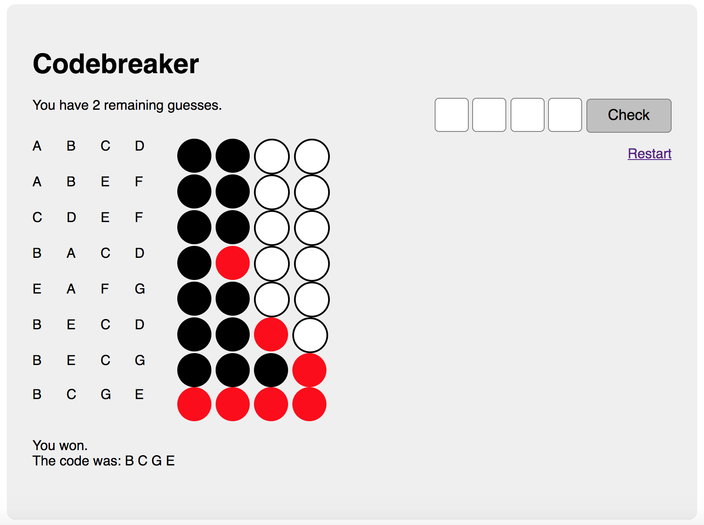

# Codebreaker 

Here's a quick summary of what it does

- Create a random four-letter code from the alphabet { A, B, C, D, E, F, G } when the user starts the game (i.e. visits the site for the first time).
- The user can guess at most ten times. If the code is incorrect then the game is lost and the code is revealed to the player.
- The hints are presented as four colored dots. You can use image files for this or CSS / SVG.
- All previous guesses are displayed.

## Example

- At first try, two letters were correct, but at the wrong position. 
- The first time "B" was moved to the front, a red dot appears.
- As soon as only black and red dots are there, you only need to rearrange the letters. If you look at the history, it should be clear how. 

